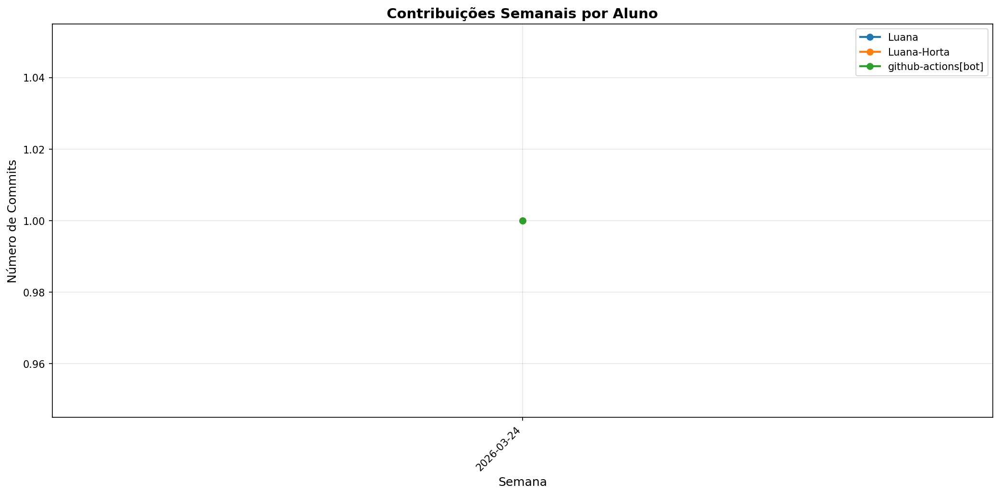

# 📊 Relatório de Contribuições do Projeto

**Última atualização:** 31/03/2026 03:04

---

## 📈 Resumo Geral de Contribuições

| Aluno               |   Commits |   Linhas+ |   Linhas- |   Arquivos |   Docs Commits |   Docs Arquivos |
|---------------------|-----------|-----------|-----------|------------|----------------|-----------------|
| Luana               |         1 |      7537 |         0 |        247 |              0 |               0 |
| Luana-Horta         |         1 |      2152 |         0 |         45 |              1 |              13 |
| github-actions[bot] |         1 |        16 |        31 |          3 |              1 |               1 |

## 📅 Contribuições Semanais (Todo o Semestre)

**2026-03-24**: Luana: 1, Luana-Horta: 1, github-actions[bot]: 1

## 📊 Visualização Gráfica

## ℹ️ Observações

- **Commits**: Número total de commits realizados

- **Linhas+**: Linhas de código adicionadas

- **Linhas-**: Linhas de código removidas

- **Arquivos**: Número de arquivos únicos modificados

- **Docs Commits**: Commits em arquivos de documentação

- **Docs Arquivos**: Arquivos de documentação modificados

---

*Relatório gerado automaticamente via GitHub Actions*
