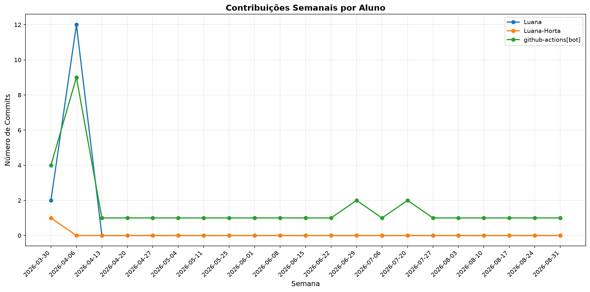

# 📊 Relatório de Contribuições do Projeto

**Última atualização:** 17/08/2026 00:35

---

## 📈 Resumo Geral de Contribuições

| Aluno               |   Commits |   Linhas+ |   Linhas- |   Arquivos |   Docs Commits |   Docs Arquivos |
|---------------------|-----------|-----------|-----------|------------|----------------|-----------------|
| Luana               |        14 |     10988 |      1528 |        307 |              2 |               0 |
| Luana-Horta         |         1 |      2152 |         0 |         45 |              1 |              13 |
| github-actions[bot] |        30 |       151 |       128 |          3 |             30 |               1 |

## 📅 Contribuições Semanais (Todo o Semestre)

**2026-08-10**: github-actions[bot]: 1

**2026-08-03**: github-actions[bot]: 1

**2026-07-27**: github-actions[bot]: 1

**2026-07-20**: github-actions[bot]: 1

**2026-07-13**: github-actions[bot]: 1

**2026-07-06**: github-actions[bot]: 1

**2026-06-29**: github-actions[bot]: 1

**2026-06-22**: github-actions[bot]: 1

**2026-06-15**: github-actions[bot]: 1

**2026-06-08**: github-actions[bot]: 1

**2026-06-01**: github-actions[bot]: 1

**2026-05-25**: github-actions[bot]: 1

**2026-05-18**: github-actions[bot]: 1

**2026-05-11**: github-actions[bot]: 1

**2026-05-04**: github-actions[bot]: 1

**2026-04-27**: github-actions[bot]: 1

**2026-04-20**: github-actions[bot]: 1

**2026-04-13**: github-actions[bot]: 1

**2026-04-06**: Luana: 12, github-actions[bot]: 9

**2026-03-30**: Luana: 2, Luana-Horta: 1, github-actions[bot]: 3

## 📊 Visualização Gráfica

## ℹ️ Observações

- **Commits**: Número total de commits realizados

- **Linhas+**: Linhas de código adicionadas

- **Linhas-**: Linhas de código removidas

- **Arquivos**: Número de arquivos únicos modificados

- **Docs Commits**: Commits em arquivos de documentação

- **Docs Arquivos**: Arquivos de documentação modificados

---

*Relatório gerado automaticamente via GitHub Actions*
